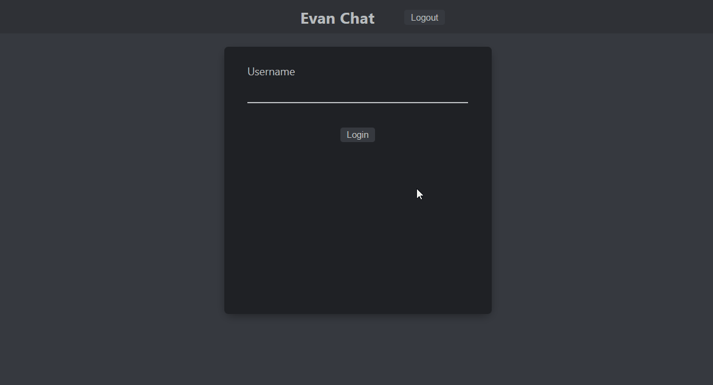

## GoLang and ReactJS Chat Web Application

A web development project to create a simple chat room experience in the browser using React w/ GoLang. 
The application can handle safe concurrent communication in Go with gorilla/websocket. 

## Running Locally

Running the backend WebSocket server:

- cd into `/backend`
- `go run main.go`

Running the frontend ReactJS application:

- cd into `/frontend`
- install dependencies with `npm install`
- `npm start`

Navigate to `http://localhost:3000/`

## Features
- Real time web-based text chat
- Allows users to log into the chatroom with a username (user info stored in browser session data)
- Chat room members will be notified when a user connects/disconnects
- Scrollable chat feed with timestamps

Example:

